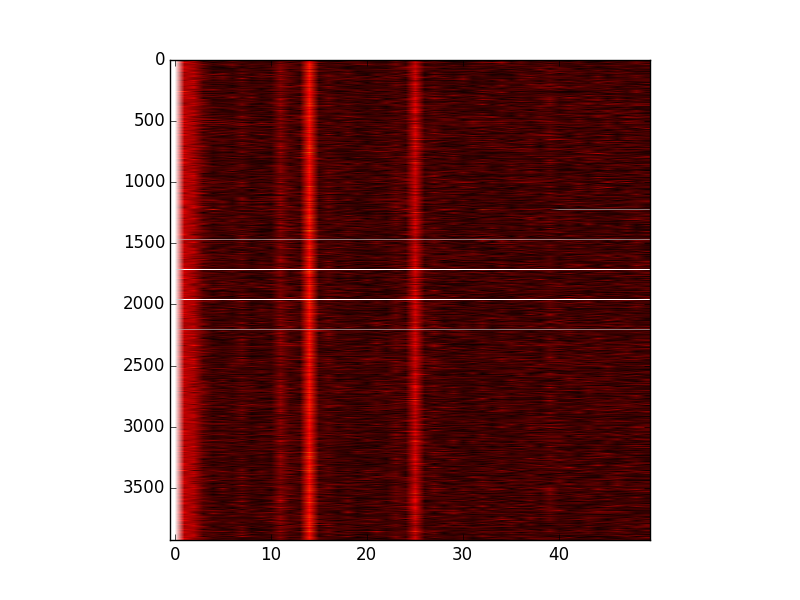

Autocorrelation scripts
=======================

This is a set of script to do autocorrelation measurements
of a DAB signal. The goal is to one day do a channel impulse
response measurement.

Right now there are three scripts:

* simulate_channel.py: Reads an I/Q file generated by ODR-DabMod and
  adds some additional components, somehow equivalent to signal reflexions.
  Each reflexion has a delay and an amplitude factor.

* autocorrelate.py: Reads the I/Q file generated by the previous script
  and calculate a set of autocorrelations on the whole signal.

* autocorrelate_window.py: Same as above, but cut the file in pieces,
  calculate the autocorrelation for each piece, and display as a 2D image.

Example image: 

The example image shows the autocorrelation (horizontal: time delay, vertical:
time offset of the different pieces) of the simulated channel.
The peaks at delay indices 0, 14 and 25 are clearly visible.

Next steps
----------
Read in a recording using a RTL-SDR receiver.

Requirements
------------
Python with NumPy and matplotlib

The iq files must be complex float.

Licence
-------
MIT. See LICENCE for details.

