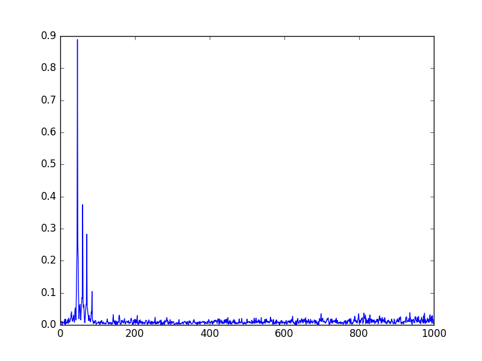

CIR scripts
===========

This is a set of script to do correlation measurement measurements
of a DAB signal. These scripts can be used to do channel impulse
response measurements using a RTLSDR receiver.

Right now there are three scripts:

* correlate_with_ref.py: Finds the NULL symbol of an IQ file, and runs
  correlations against the known phase reference to find the components.

* simulate_channel.py: Reads an I/Q file generated by ODR-DabMod and
  adds some additional components, somehow equivalent to signal reflexions.
  Each reflexion has a delay and an amplitude factor.

* cir_measure.py: Runs a small webserver that does the correlation
  all the time and updates a webpage

Example image: 

The image shows the received CIR of a real DAB signal captured with the RTLSDR.

Webserver
---------

To run the webserver on all network interfaces, receiving on 202.928MHz:

    ./cir_measure.py --host 0.0.0.0 --port 8080 --freq 202928000

More options are available (gain, number of samples), see the help with

    ./cir_measure.py -h

Offline processing
------------------

To read in a recording using a RTL-SDR receiver, use:

    rtl_sdr -f 188928000 -s 2048000 -g 20 -S - | \
    dd of=DAB_9A_10_u8_G20.iq bs=2 count=1966080

replace 1966080 (ten Mode 1 transmission frames) by a larger value if you want.

Then feed the data to the script

    ./correlate_with_ref.py u8 DAB_9A_10_u8_G20.iq

Requirements
============
librtlsdr and its tools.

Python with NumPy and matplotlib.

The iq files must be complex float or interleaved unsigned 8-bit.

Licence
=======
MIT. See LICENCE for details.

